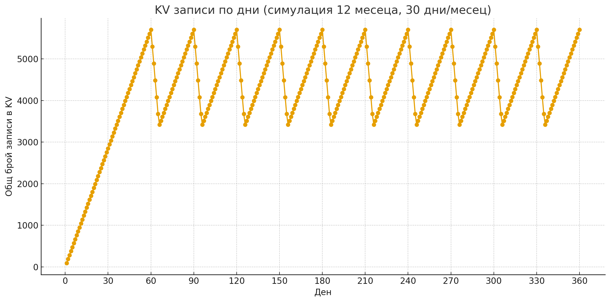

# Ping Worker

## Описание и цел
**Ping Worker** е Cloudflare Worker, който поддържа бекенд услугата будна.  
Основната му цел е:
- Да изпраща ping към бекенд приложението на всеки 12 минути, за да не заспива (бекендът заспива след 15 минути без активност).  
- KV записите се съхраняват като страничен ефект и се използват от **Status Worker** за визуализиране на история и статус на услугата.  

## Как работи
- Worker-ът се изпълнява по cron график на всеки 12 минути.
- При всяко изпълнение прави ping към бекенд услугата.
- Резултатът се записва в KV с ключ, маркиращ месеца и точния момент на пинга.
- Между 12:00–12:59 Софийско време се изтриват стари записи от най-стария месец, за да се освобождава пространство и да не се надхвърля безплатната квота на Cloudflare.

## Графика на KV записите
Следната графика илюстрира как се пълни KV-то и как се изчистват записи:  

**Обяснение на графиката:**
- В първите два месеца KV-то се пълни нормално с ping записи на всеки 12 минути.
- На третия месец започва системата за изтриване:
  - Между 12:00–13:00 се извършват до 5 изтривания по 100 записа.
  - През няколко дни целият най-стар месец се изчиства постепенно.
- Така се контролира пространството в KV и се спазва безплатната квота на Cloudflare.

## Връзка със Status Worker
- KV записите от Ping Worker се използват от **Status Worker** за визуализация на uptime и текущ статус.  
- Адрес на Status Worker:  
https://uptime-status.acidlord-34.workers.dev/

## Как да се използва
- Настрой `BACKEND_URL` в wrangler.toml.
- Настрой KV namespace за логовете.
- Deploy с wrangler.
- Worker-ът ще работи автоматично според cron графика.
- Може да се извика и ръчно чрез HTTP fetch:  
https://keep-awake.acidlord-34.workers.dev/

Отговор при ръчен fetch:
Ping executed → check status page for results
Current status: up|down

## Основни идеи
1. **Държи бекенда буден:** ping на всеки 12 минути предотвратява заспиване.  
2. **KV записи:** страничен резултат за Status Worker.  
3. **Автоматично изчистване:** за контрол на KV пространството и спазване на безплатната квота.
